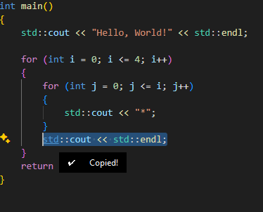
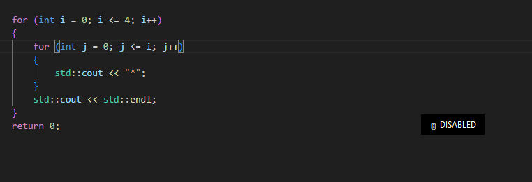

# COPY-LISTENER

Are you one of the people who pres ctrl+c multiple times to make sure you already copied the content you want to copy here's a solution for that.<br\>

- It will only be triggered if you selected something(highlighted) text, folder etc.<br\>
- If you want to run it all the time put the exe file on the startup. If not just double click the exe file to run the script and you're good to go.
- To close the close/disable the program pres ctrl+alt+shift+c

sample image:
  - successful copy
  
  - disabled
  
